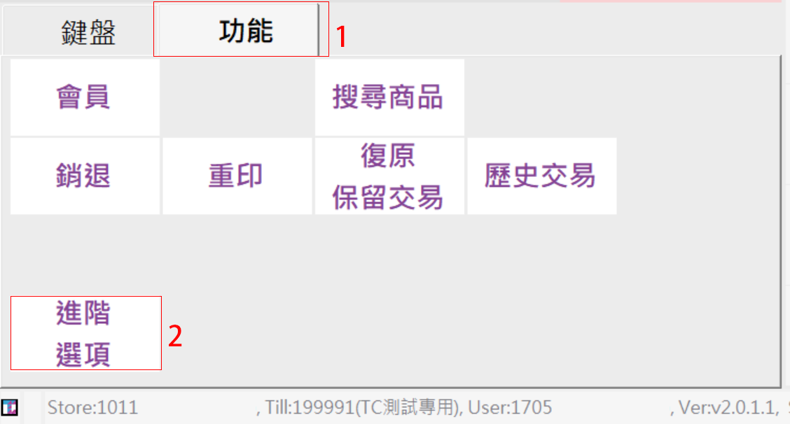

# 連結頁籤

1. **連結頁籤**

當商品品項數量大於POS前台單頁所能顯示的數量36顆按鈕\(9x4\)時，我們可以運用頁籤的概念來切換，以達到上一頁、下一頁的目的。

要能達到切換頁籤的目的，必須要有兩頁以上才能達到，因此需先新增一個新的頁面，如上圖所示。

**頁碼**的部分強烈建議依照流水號方式編排，例如1, 2,3,4,5…以此類推。

**頁名稱**，是給予該頁面一個簡單容易記的住、可讀性的名稱，可以依據商店型態與產品種類給予名稱，例如主餐、飲料、甜點。

按照以下流程操作

1. 點選”**新增**”按鈕
2. 畫面會出現 “**維護頁**”的小視窗
3. 在”**維護頁**”裡面，請依上述方式給予**頁碼**以及**頁名稱**。
4. 點選要新增的按鈕。
5. 在**連結頁碼**的地方有下拉式選單
6. 選定要跳轉的頁碼，範例中為跳轉到第二頁
7. 按下**確認**鍵

設定完之後的畫面會如左圖所示。

\*在進行編輯完之後一定要按最上方的**儲存**按鈕

**備註**

1. 新增快速鍵之後，前台銷售畫面沒有任何動靜？

在新增快速鍵之後，需要重新更新主檔，因此必須在前台的POS中執行主檔更新，更新方式如下：

在前台的銷售畫面中請點選”**功能**”，之後左下角會出現”**進階選項**＂，畫面會切換到帶有更多選項的頁籤。

此時畫面中會出現一個”**主檔更新**”的按鈕，點擊之後，tcPOS會自動更新並重新開啟，再重新登入即可。

