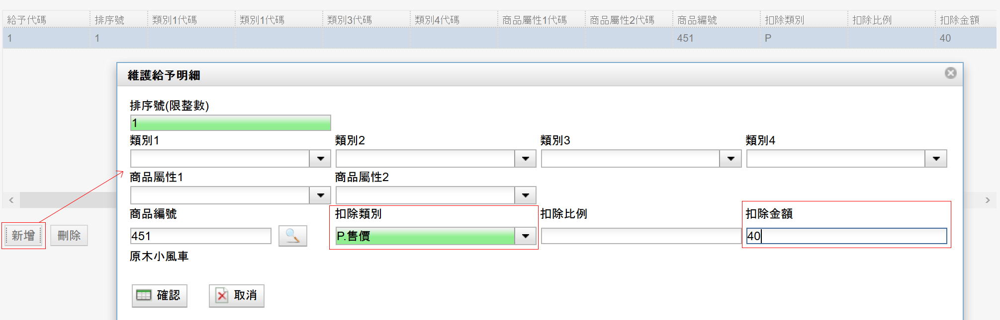

# 加價購

有時候再消費的時候會看到買A商品加xx元即可獲得B商品，這裡的加價購概念對於系統裡面的折扣活動來說是減去價格。

以下的範例將會以購買芝麻葉薯泥香草醬沙朗牛排加40元即可購買原木小風車乙個。

折扣設定如下

Root → 根 → 收銀機 → 折扣設定

點”**新增**”按鈕新增折扣活動，折扣類別設定A.M.自動折扣，這樣只要在按下結帳按鈕的時候，系統會自動帶入適合的折扣活動。

扣除類別請選擇”O.給予”，扣除金額設定數字40，意思是只要觸發條件的時候，就給予折扣40元。（但是對消費者來說還是要多花40元才能購買該樣商品。）

切換到”條件”的頁籤，新增要被觸發的條件，下圖中以數量為計算基礎，當消費者購買一客牛排後即獲得一次加價購的資格。

條件頁面的下面大欄位是定義消費者必須買甚麼樣的產品才會符合資格，按一下”新增”按鈕後系統會帶出選擇商品的視窗，搜尋要設定的商品後按”選擇”確認離開。

切換至”給予”頁籤，可以設定折扣給予的上限，圖中最大作用數設定為10，表示當商品數量超過10的之後，折扣活動將不再發生，只給予前面10個商品折扣。

在給予的頁面欄位下按一下”新增”按鈕，設定要加價購的商品，如果不知道商品編號的話可以點選放大鏡搜尋商品編號，在扣除類別的部分請選擇”P.售價”，扣除金額設定為40元。

設定完成後，一定、務必點選最上方的”儲存”按鈕。

設定測試後畫面，最大作用數10次，第11次的時候就沒有折扣。

