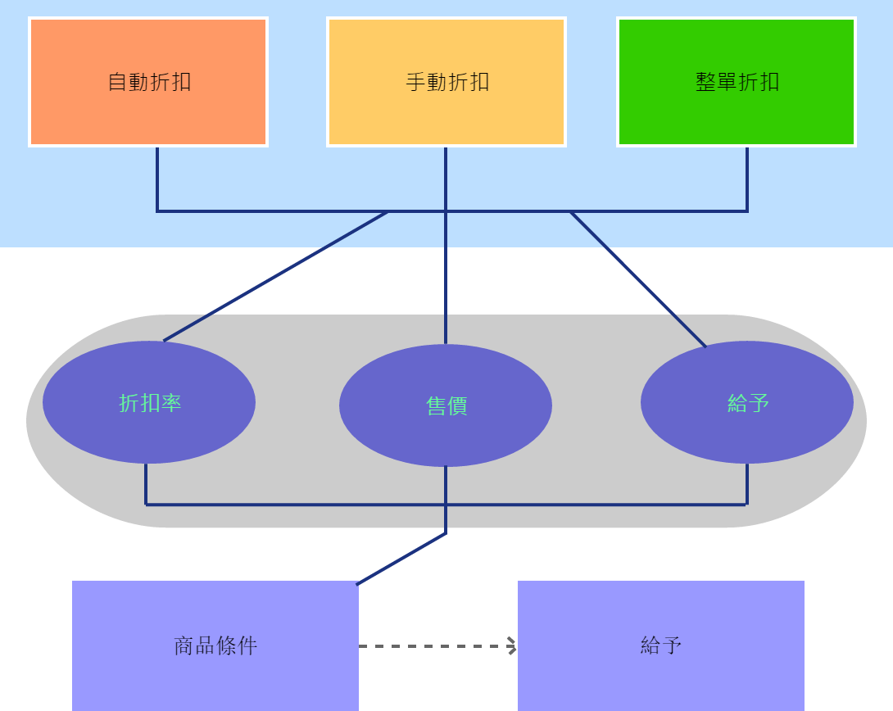

# 販促概觀

販促活動的模型大致如下，首先要先決定該筆販促是要以甚麼方式去處理，接著再決定要以甚麼形式給予折扣，最後再決定要成立的條件。

販促主要的介面如下

**折扣**的頁籤為販促活動的主題，以及它的主要時間跟主要條件。

**條件**的話則是販促裡面的細項，主要是控制是否能讓販促活動是否成立。

**給予**的頁籤主要是在控制買一送一或是給予折扣的活動。

現行的tcPOS提供了彈性的設定，可以按照需求進行設定。

| 折扣類別 | 條件主檔 | 條件細項 | 給予 |
| :--- | :--- | :--- | :--- |
| 自動折扣\(小計後折扣\) | 滿額 | 分類 | 商品 |
| 手動折扣 | 滿量 | 排除 | 扣除比例 |
| 銷售折扣\(整單折扣\) |  |  | 扣除金額 |

