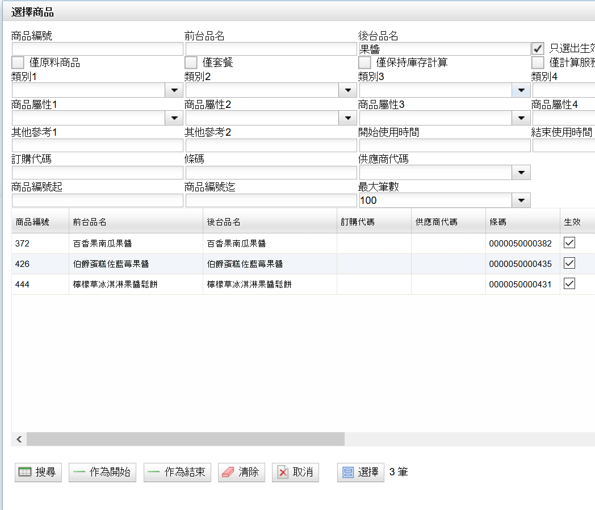

# 買A送B

買A送B與買一送一的概念有點類似，以下範例將以買A送B為主；如要設定買一送一的話，在特定步驟只要將品項替換成同品項即可達到買一送一的贈品活動。以下的範例將設定為消費者購買一罐百香果南瓜果醬就可以免費獲得芥末醬一罐。

折扣設定選項位於以下路徑：

Root → 根 → 收銀機 → 折扣設定

按一下”**新增**”按鈕，新增折扣活動

＊綠色底為必填項目。

名詞解釋：

| 項目 | 解釋 |  |
| :--- | :--- | :--- |
| 扣除類別 | D.折扣率 | 按照比例給予商品售價折扣，如果設定成10的話就是打９折。 |
| P.售價 | 強制設定商品售價為ｘｘ元。 |  |
| O.給予 | 用於買一送一或是買Ａ送Ｂ的活動中，一種贈與的行為。 |  |
| 每筆交易最大作用數 | 每一筆交易裡面可以有重複Ｎ次的折扣，如果設定為１，代表一筆交易裡面只會發生一次。 |  |
| 折扣類別 | MI.手動商品折扣 | 針對商品品項給予折扣。 |
| MS.手動銷售折扣 | 針對交易給予折扣。 |  |
| AM.自動折扣 | 當銷售人員按下”結帳”時，系統會自動根據設定的活動給予折扣，毋須人工操作。 |  |

接著切換到 “**條件**”的頁籤，進行設定折扣的規則。

點一下”**新增**”按鈕，**條件代碼**建議以數字做為流水號，**條件種類**請選擇數量，**數量基礎**請設定為1，設定完成後按”**確認**”按鈕離開。

名詞解釋：

| 項目 | 解釋 |  |
| :--- | :--- | :--- |
| 條件種類 | Q.數量 | 設定商品必須買的數量才能夠給予折扣。 |
|  | A.總計 | 設定商品必須買到xx金額才能夠給予折扣。 |
| 數量基礎 | 設定為1表示買1個商品就可以給予折扣，以此類推。 |  |
| 總計基礎 | 設定為特定數字的時候，代表必須某項商品必須買到特定金額才會觸發折扣條件。 |  |

設定好消費者必須購買的基礎數量或金額之後，接下來要設定的部分是，消費者必須買甚麼樣的商品才能夠符合資格。粗淺的來說，在”**條件**”頁籤這個頁面內，上半部是基礎數量或金額，下半部則是設定必須購買的商品。這兩者必須都兼具後才會觸發買A送B的規則。

排序號以數字1~N作為流水號，商品編號的部分則是設定消費者必須購買哪一種商品才能夠符合資格，可以按左邊的放大鏡搜尋商品資料庫。

下圖的範例是以果醬為例子，消費者買一罐百香果南瓜果醬就符合資格

點一下百香果南瓜果醬之後按”**選擇**”按鈕離開。

接著切換到”**給予**”的頁面，只有在最一開始的”**扣除類別**”設定成”**給予**”的時候，才需要設定該頁面。

按一下”**新增**”按鈕，**給予代碼**的部分以數字的流水號為主，**最大作用數**設定為1，意思是消費者今天如果買了10罐百香果南瓜果醬在一筆交易裡面，常理來說消費者可以拿到10罐免費的芥末醬，若是設定為1的話就是代表只能拿到一罐芥末醬。

接著再給予代碼的欄位設定要贈送的商品，按一下”**新增**”，排序號以數字為主的流水號，**商品編號**的部分就是設定要送給消費者甚麼商品，可以按一下放大鏡搜尋商品項目，扣除類別的部分以”**D.折扣率”**為主”，”**扣除比例”**設定為100，表示100% Off，意即免費。

\*這裡商品編號設定成跟消費者購買一樣的項目的時候就等同是買一送一了!

門市的部分可以指定要給予部分門市參與這項活動或是全部門市都參與，按”**新增**”按鈕後可以自行指定。

折扣活動設定完成後，請務必、一定要按最上方的”**儲存**”按鈕，存檔。

