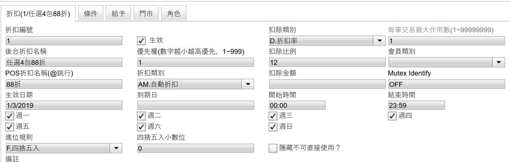
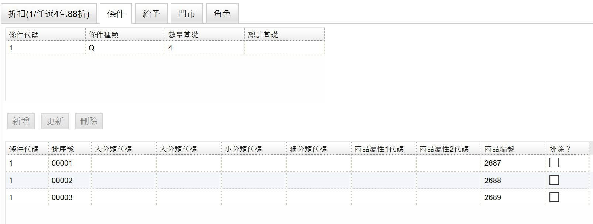
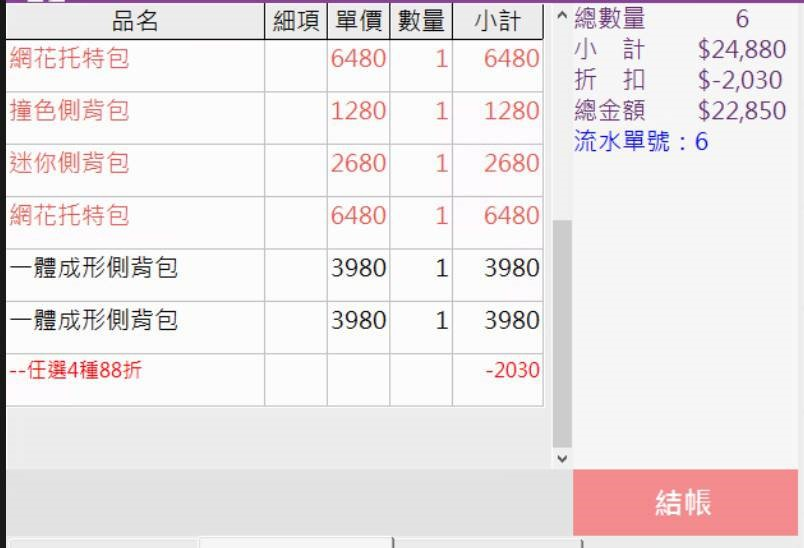

# 任選4件N折

販促情境: 任選四種商品打88折。

販促設定行為是在tcPOS的管理平台上設定

主要的部分是在於以下幾個設定


折扣率



扣除比例



每筆交易最大作用數：這邊要注意設定，如果只設定1的話，代表著如果消費者都各買兩樣的時候，折扣只會發生一次，不會發生兩次


這邊是販促主要的核心設定；折扣類別可以選擇自動折扣或是手動銷售折扣。

接著就是切換到條件去指定哪幾種商品需要可以去觸發販促行為

最上面的數量基礎4，代表著買商品的數量要達到4種才能夠觸發販促條件。

最後下面就是POS觸發販促條件後的畫面

